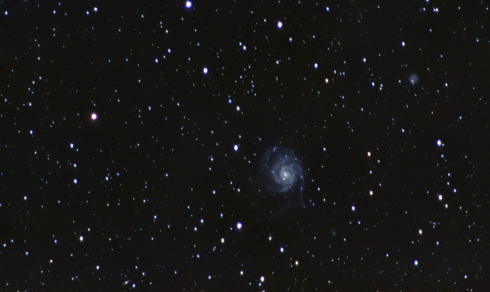
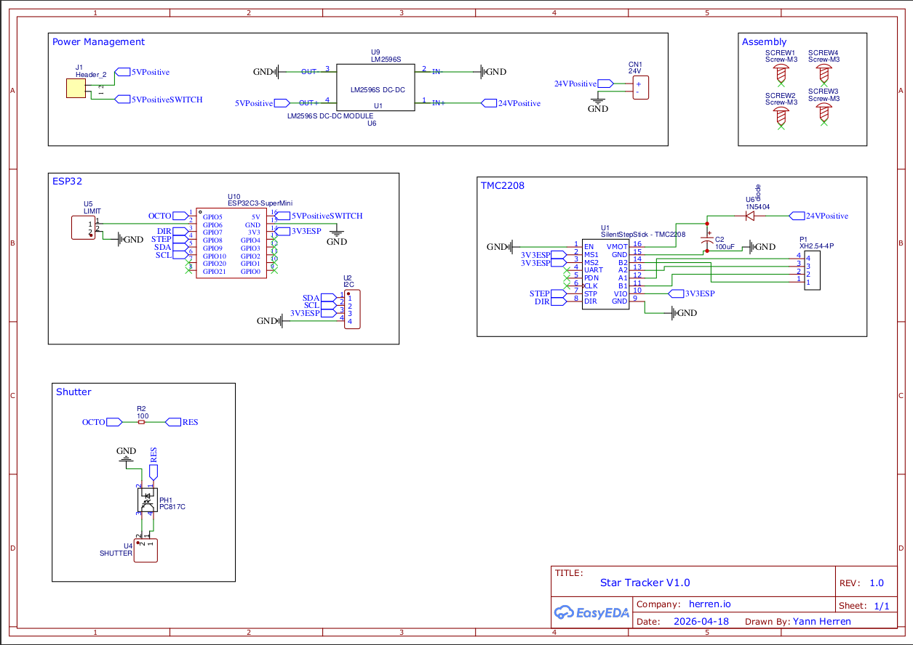

# Stellavue - Star Tracker Onboard Software (ESP32-C3, Rust)

Onboard firmware for a DIY star tracker built on the ESP32-C3, written in Rust.

Stellavue is an embedded firmware project designed to control a motorized star tracker for astrophotography. It runs on an ESP32-C3 Super Mini and provides precise stepper motor control as well as wireless interaction via Wi-Fi.


<br/>
Image of the Pinwheel Galaxy (M101) taken using the star tracker running the stellavue firmware

## Documentation & Article
The full documentation and article about the project can be found 
[here](https://herren.io/projects/improved-star-tracker).

## Hardware Requirements

- ESP32-C3 (Super Mini or compatible)
- Stepper motor
- TMC2208 stepper motor driver
- External power supply suitable for motor and controller

### PCB schematic



## Software Requirements

- Rust (nightly toolchain)
- ESP-IDF
- espup
- cargo-espflash

## Installation

### 1. Clone the Repository

```bash
git clone https://github.com/yannherren/stellavue.git
cd stellavue
```

### 2. Install Rust Toolchain

Ensure Rust nightly is installed and active:

```bash
rustup install nightly
rustup default nightly
```

### 3. Install ESP Toolchain

Set up the ESP-IDF toolchain using espup:
```bash
espup install
```

### 4. Build & Flash the Firmware

Connect the ESP32-C3 to your computer via USB.

Flash the firmware:

```bash
cargo run
```

or just build without flashing:
```bash
cargo build
```


## Usage

After flashing, the ESP32-C3 will start the firmware automatically.
Once connected to the configured Wi-Fi network `Stellavue`, the star tracker can be controlled remotely via the provided web interface running on `http://stellavue.local`.

Further usage details and documentation about the protocol between the web interface and the esp can be found in the `docs/` directory.

## License
This project is licensed under the Apache License 2.0. See the `LICENSE` file for details.
