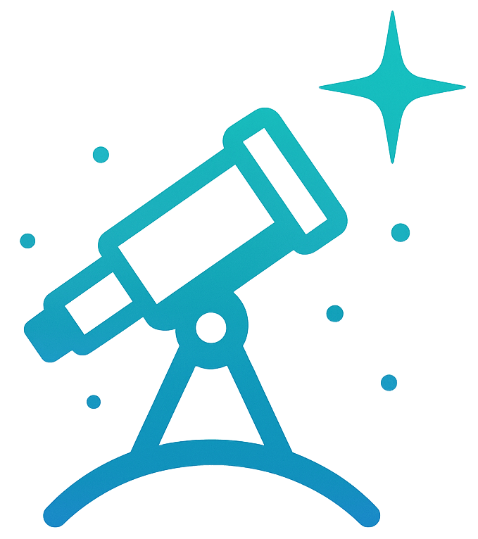

# 🌟 Stellavue - Star Tracker Onboard Software (ESP32-C3, Rust)

This is the onboard software for a DIY star tracker, running on an ESP32-C3 Super Mini board using Rust. The project uses [`esp-idf-hal`](https://github.com/esp-rs/esp-idf-hal) and [`esp-idf-svc`](https://github.com/esp-rs/esp-idf-svc) for hardware abstraction and services.

## ✨ Features

- 🚀 Stepper motor control for star tracking
- 💡 Smartphone control over wifi

## 🛠️ Hardware

- **Board:** ESP32-C3 Super Mini
- **Motor:** TMC2208 Stepper motor driver

## ⚡ Build & Flash

Requirements:
- 🦀 Rust toolchain (nightly required)
- [espup](https://github.com/esp-rs/espup) for toolchain setup
- ESP-IDF installed
